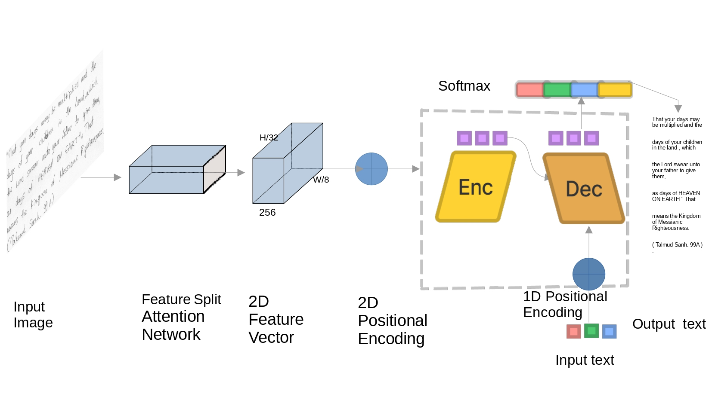

## ResneSt-Transformer: joint attention segmentation-free for end-to-end handwriting paragraph recognition model
HTR Handwriting Paragraph recognition (OCR) 

### Upcoming improvements that we will be implementing in our GitHub repository to enhance the readability, maintainability, and overall user-friendliness including: 
#### 1) Code Formatting.
#### 2) Code Commenting.
#### 3) File and Folder Organization.
#### 4) Readme File.
#### 5) Code Refactoring.
